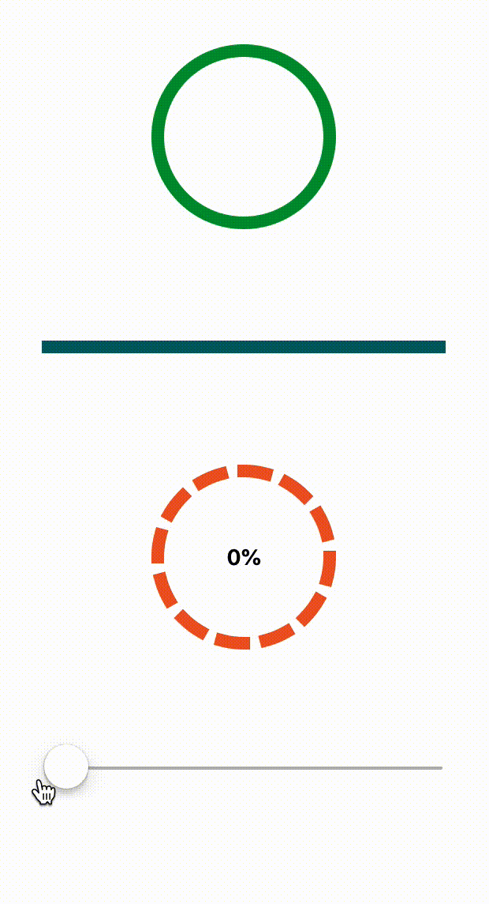

# Custom progress view

## Custom progress view using CALayer.

This repo contains playground and sources for my blog article: [CALayerAnimations](https://avdyushin.ru/blog/calayer-animations/)

How it looks like:

<p align="center">
    
</p>

## Usage

To create custom view progress bar you should create custom layer subclassing `BaseProgressLayer`.
Then subclass `ProgressView` with your layer or even just make a type alias.

```
class MyLayer: BaseProgressLayer {
    override draw(in ctx: CGContext) {
        // Custom drawing of the progress bar
    }
}

typealias MyProgressView = ProgressView<MyLayer>
```
